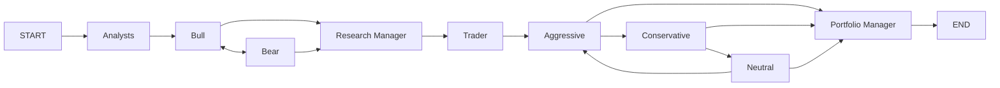

# TradingAgents Code Wiki

面向目标：帮助你快速理解该仓库的整体架构、主要模块职责、关键类与函数、依赖关系，以及如何运行/开发/扩展。

## 目录

- [1. 项目概览](#1-项目概览)
- [2. 代码与模块总览](#2-代码与模块总览)
- [3. 系统架构与依赖关系](#3-系统架构与依赖关系)
- [4. 核心工作流（LangGraph）](#4-核心工作流langgraph)
- [5. Agents（角色）层](#5-agents角色层)
- [6. Tools & Dataflows（数据源与路由）](#6-tools--dataflows数据源与路由)
- [7. LLM Clients（多 Provider 适配）](#7-llm-clients多-provider-适配)
- [8. CLI（交互式终端）](#8-cli交互式终端)
- [9. 配置、输出与运行产物](#9-配置输出与运行产物)
- [10. 运行方式（本地 / Docker）](#10-运行方式本地--docker)
- [11. 测试与质量保障](#11-测试与质量保障)
- [12. 扩展指南](#12-扩展指南)

## 1. 项目概览

TradingAgents 是一个基于 LLM 的“多角色交易研究与决策”框架，使用 LangGraph 将多个 Agent（分析师/研究员/交易员/风控/组合经理）编排为一个有状态的工作流，并通过工具层获取行情、指标、基本面与新闻数据，最终输出交易决策（BUY/HOLD/SELL 等）。

- 入口：`TradingAgentsGraph().propagate(ticker, date)`（见 [trading_graph.py](file:///workspace/tradingagents/graph/trading_graph.py#L43-L226)）
- CLI 入口：`tradingagents` → `cli.main:app`（见 [pyproject.toml](file:///workspace/pyproject.toml#L35-L37)、[main.py](file:///workspace/cli/main.py#L36-L40)）
- Docker 入口：镜像 `ENTRYPOINT ["tradingagents"]`（见 [Dockerfile](file:///workspace/Dockerfile#L13-L27)）

## 2. 代码与模块总览

仓库顶层目录（关键边界）：

- `tradingagents/`：核心库
  - `graph/`：LangGraph 编排与执行（工作流主入口）
  - `agents/`：各角色 Agent + 通用状态/工具/记忆
  - `dataflows/`：数据供应商适配与路由（yfinance / alpha_vantage）
  - `llm_clients/`：多 LLM Provider 客户端、模型目录与校验
  - `default_config.py`：默认配置
- `cli/`：Typer + Rich 的交互式终端应用
- `tests/`：核心行为测试
- 根目录：
  - `README.md`：运行方式与使用示例（见 [README.md](file:///workspace/README.md)）
  - `pyproject.toml`：依赖与脚本入口（见 [pyproject.toml](file:///workspace/pyproject.toml)）
  - `.env.example / .env.enterprise.example`：环境变量模板（见 [.env.example](file:///workspace/.env.example)、[.env.enterprise.example](file:///workspace/.env.enterprise.example)）

## 3. 系统架构与依赖关系

### 3.1 组件依赖（模块级）

```mermaid
flowchart TD
  CLI[cli/* (Typer + Rich)] --> TG[TradingAgentsGraph]
  TG --> GS[GraphSetup (build LangGraph)]
  GS --> LG[LangGraph StateGraph]
  TG --> LLMF[llm_clients.create_llm_client]
  TG --> MEM[FinancialSituationMemory]
  GS --> AGENTS[agents.create_* nodes]
  AGENTS --> TOOLS[agents/utils/* @tool functions]
  TOOLS --> ROUTER[dataflows.interface.route_to_vendor]
  ROUTER --> YF[dataflows.y_finance / yfinance_news]
  ROUTER --> AV[dataflows.alpha_vantage*]
  TG --> CFG[dataflows.config.set_config]
```

### 3.2 关键依赖（从打包声明看）

依赖声明位于 [pyproject.toml](file:///workspace/pyproject.toml#L5-L33)，其中关键依赖包括：

- LangGraph / LangChain：工作流与工具调用基础
- Typer / Rich / questionary：交互式 CLI
- yfinance / requests / pandas / stockstats：行情与指标
- rank-bm25：离线“相似情景记忆”检索

## 4. 核心工作流（LangGraph）

### 4.1 主入口类：TradingAgentsGraph

位置：[TradingAgentsGraph](file:///workspace/tradingagents/graph/trading_graph.py#L43-L285)

- `__init__(selected_analysts, debug, config, callbacks)`：
  - 通过 `dataflows.config.set_config()` 设置全局运行配置（见 [trading_graph.py](file:///workspace/tradingagents/graph/trading_graph.py#L65-L67)）
  - 创建 `results_dir` / `data_cache_dir`（见 [trading_graph.py](file:///workspace/tradingagents/graph/trading_graph.py#L68-L71)）
  - 创建 provider 对应 LLM client（深/浅两套）并拿到 LangChain LLM（见 [trading_graph.py](file:///workspace/tradingagents/graph/trading_graph.py#L72-L94)）
  - 初始化多个记忆实例（bull/bear/trader/judges）（见 [trading_graph.py](file:///workspace/tradingagents/graph/trading_graph.py#L95-L101)）
  - 构建工具节点 `ToolNode`（market/social/news/fundamentals）（见 [trading_graph.py](file:///workspace/tradingagents/graph/trading_graph.py#L156-L190)）
  - 组装 `ConditionalLogic` + `GraphSetup` + `Propagator` + `Reflector` + `SignalProcessor`（见 [trading_graph.py](file:///workspace/tradingagents/graph/trading_graph.py#L105-L124)）
  - `setup_graph(selected_analysts)` 编译 LangGraph（见 [trading_graph.py](file:///workspace/tradingagents/graph/trading_graph.py#L131-L133)）

- `propagate(company_name, trade_date)`：
  - 使用 `Propagator.create_initial_state()` 生成初始 `AgentState`（见 [trading_graph.py](file:///workspace/tradingagents/graph/trading_graph.py#L192-L217)、[propagation.py](file:///workspace/tradingagents/graph/propagation.py#L18-L55)）
  - debug 模式下 `graph.stream(...)` 打印每步消息；否则 `graph.invoke(...)`（见 [trading_graph.py](file:///workspace/tradingagents/graph/trading_graph.py#L203-L217)）
  - 落盘完整状态日志 JSON（见 [trading_graph.py](file:///workspace/tradingagents/graph/trading_graph.py#L227-L266)）
  - 用 `SignalProcessor.process_signal(...)` 从长文本中抽取标准化 rating（见 [trading_graph.py](file:///workspace/tradingagents/graph/trading_graph.py#L224-L226)、[signal_processing.py](file:///workspace/tradingagents/graph/signal_processing.py#L13-L33)）

### 4.2 GraphSetup：如何拼装工作流

位置：[GraphSetup.setup_graph](file:///workspace/tradingagents/graph/setup.py#L13-L201)

核心逻辑：

- 分析师节点按用户选择顺序串联（market/social/news/fundamentals），每个 analyst 节点后面挂一个对应的 `tools_*` ToolNode，并通过 `ConditionalLogic.should_continue_*` 决定是否继续调用工具还是清空消息并进入下一节点（见 [setup.py](file:///workspace/tradingagents/graph/setup.py#L54-L153)、[conditional_logic.py](file:///workspace/tradingagents/graph/conditional_logic.py#L14-L45)）
- 研究辩论阶段：Bull ↔ Bear 多轮，由 `ConditionalLogic.should_continue_debate` 根据 `count` 决定继续辩论还是进入 Research Manager（见 [setup.py](file:///workspace/tradingagents/graph/setup.py#L154-L171)、[conditional_logic.py](file:///workspace/tradingagents/graph/conditional_logic.py#L46-L56)）
- Trader 输出交易提案
- 风控三方循环：Aggressive → Conservative → Neutral，多轮后进入 Portfolio Manager（见 [setup.py](file:///workspace/tradingagents/graph/setup.py#L172-L199)、[conditional_logic.py](file:///workspace/tradingagents/graph/conditional_logic.py#L57-L67)）

一个“抽象化”的流程图如下：



### 4.3 状态模型：AgentState / InvestDebateState / RiskDebateState

位置：[agent_states.py](file:///workspace/tradingagents/agents/utils/agent_states.py#L6-L72)

- `AgentState(MessagesState)`：工作流的全局 state，包含用户标的、日期、各报告字段、辩论状态与最终决策字段等
- `InvestDebateState`：bull/bear 历史、judge_decision、count 等
- `RiskDebateState`：三方风控历史、latest_speaker、judge_decision、count 等

### 4.4 Propagator：初始 state 与 LangGraph 参数

位置：[Propagator](file:///workspace/tradingagents/graph/propagation.py#L11-L69)

- `create_initial_state(company_name, trade_date)`：初始化 `messages` 与各 state 字段默认值
- `get_graph_args(callbacks=None)`：提供 `stream_mode="values"`、`config={"recursion_limit": ... , "callbacks": ...}`（CLI 会把 stats callback 透传进去，用于 tool call 统计）

### 4.5 Reflector + Memory：复盘与“相似情景记忆”

- `FinancialSituationMemory`（BM25 离线检索）：[memory.py](file:///workspace/tradingagents/agents/utils/memory.py#L12-L99)
  - `add_situations([(situation, recommendation), ...])`：写入历史情景与建议
  - `get_memories(current_situation, n_matches)`：基于 BM25 相似度返回 top-N 建议
- `Reflector`：[reflection.py](file:///workspace/tradingagents/graph/reflection.py#L6-L120)
  - `reflect_*`：对 bull/bear/trader/judges 的历史决策进行复盘并写入对应 memory
- `TradingAgentsGraph.reflect_and_remember(returns_losses)` 统一触发复盘（见 [trading_graph.py](file:///workspace/tradingagents/graph/trading_graph.py#L267-L283)）

## 5. Agents（角色）层

### 5.1 Agents 模块组织

统一导出位于 [agents/__init__.py](file:///workspace/tradingagents/agents/__init__.py#L1-L40)，GraphSetup 通过这些 `create_*` 工厂函数创建节点。

- Analysts：`tradingagents/agents/analysts/*`
- Researchers：`tradingagents/agents/researchers/*`
- Trader：`tradingagents/agents/trader/trader.py`
- Risk mgmt：`tradingagents/agents/risk_mgmt/*`
- Managers：`tradingagents/agents/managers/*`
- Utilities：`tradingagents/agents/utils/*`

### 5.2 一个典型 Analyst 节点结构

以 Market Analyst 为例（见 [market_analyst.py](file:///workspace/tradingagents/agents/analysts/market_analyst.py#L11-L88)）：

- 输入：读取 `state["company_of_interest"]`、`state["trade_date"]`、`state["messages"]`
- 工具：声明 `tools=[get_stock_data, get_indicators]` 并通过 `llm.bind_tools(tools)` 让模型决定是否调用工具
- 输出：
  - `messages: [result]`（LangGraph 的消息流）
  - `market_report: report`（写回到 AgentState）

语言输出策略：

- `get_language_instruction()` 根据全局 config 的 `output_language` 决定是否强制“用某语言输出”，默认 English 时返回空字符串（见 [agent_utils.py](file:///workspace/tradingagents/agents/utils/agent_utils.py#L23-L35)）

标的符号保真策略：

- `build_instrument_context(ticker)` 强调保留交易所后缀，避免工具调用失败或跑偏（见 [agent_utils.py](file:///workspace/tradingagents/agents/utils/agent_utils.py#L37-L43)）

### 5.3 Trader：如何产出“最终交易提案”

位置：[create_trader](file:///workspace/tradingagents/agents/trader/trader.py#L6-L47)

- 组合上下文：把 market/sentiment/news/fundamentals + investment_plan 拼成“当前情景”，并从 memory 里检索相似情景的复盘建议（见 [trader.py](file:///workspace/tradingagents/agents/trader/trader.py#L16-L25)）
- 提示词要求：结尾必须包含 `FINAL TRANSACTION PROPOSAL: **BUY/HOLD/SELL**`，作为“决策终止信号”（见 [trader.py](file:///workspace/tradingagents/agents/trader/trader.py#L31-L35)）

### 5.4 Message 清理节点（Anthropic 兼容）

`create_msg_delete()` 会移除所有历史消息并追加一个 `HumanMessage("Continue")` 占位，避免某些 provider 对空对话不兼容（见 [agent_utils.py](file:///workspace/tradingagents/agents/utils/agent_utils.py#L45-L58)、[conditional_logic.py](file:///workspace/tradingagents/graph/conditional_logic.py#L14-L45)）。

## 6. Tools & Dataflows（数据源与路由）

### 6.1 接口与 vendor 路由规则

核心路由位于 [interface.py](file:///workspace/tradingagents/dataflows/interface.py#L30-L162)：

- “工具”按类别归档：`TOOLS_CATEGORIES`（core_stock_apis / technical_indicators / fundamental_data / news_data）
- `get_vendor(category, method=None)`：
  - tool-level `tool_vendors[method]` 优先于 category-level `data_vendors[category]`（见 [interface.py](file:///workspace/tradingagents/dataflows/interface.py#L119-L133)）
- `route_to_vendor(method, *args, **kwargs)`：
  - 允许用逗号分隔配置 fallback chain（例如 `"alpha_vantage,yfinance"`）
  - 只在 `AlphaVantageRateLimitError` 时触发 fallback，其他异常不会自动降级（见 [interface.py](file:///workspace/tradingagents/dataflows/interface.py#L134-L162)）

### 6.2 全局 config 注入与读取

- 全局配置通过 `dataflows.config.set_config(config)` 注入，`get_config()` 读取（见 [config.py](file:///workspace/tradingagents/dataflows/config.py#L15-L27)）
- 注入发生在 `TradingAgentsGraph.__init__`（见 [trading_graph.py](file:///workspace/tradingagents/graph/trading_graph.py#L65-L67)）

### 6.3 默认 vendor 与可选 API key

默认配置：`data_vendors` 全部指向 `yfinance`（不需要 AlphaVantage key），可按需切换（见 [default_config.py](file:///workspace/tradingagents/default_config.py#L25-L37)、示例 [main.py](file:///workspace/main.py#L15-L21)）。

## 7. LLM Clients（多 Provider 适配）

### 7.1 工厂：create_llm_client

位置：[create_llm_client](file:///workspace/tradingagents/llm_clients/factory.py#L15-L49)

- OpenAI-compatible：`openai/xai/deepseek/qwen/glm/ollama/openrouter` 走 `OpenAIClient`
- 其他：`anthropic`、`google`、`azure` 走各自 client

### 7.2 Provider 特定“思考/推理参数”透传

`TradingAgentsGraph._get_provider_kwargs()` 会根据 `llm_provider` 把 `google_thinking_level` / `openai_reasoning_effort` / `anthropic_effort` 透传给 client（见 [trading_graph.py](file:///workspace/tradingagents/graph/trading_graph.py#L134-L154)）。

### 7.3 模型目录与校验

- CLI 模型目录：`MODEL_OPTIONS`（见 [model_catalog.py](file:///workspace/tradingagents/llm_clients/model_catalog.py#L11-L115)）
- `validate_model(provider, model)`：对大多数 provider 做白名单校验；openrouter/ollama 接受任意 model（见 [validators.py](file:///workspace/tradingagents/llm_clients/validators.py#L13-L27)）

## 8. CLI（交互式终端）

### 8.1 CLI 入口与核心流程

入口与 App 定义：`app = typer.Typer(...)`（见 [cli/main.py](file:///workspace/cli/main.py#L36-L40)）

主流程位于 `run_analysis()`（见 [cli/main.py](file:///workspace/cli/main.py#L929-L1111)）：

- 调用 `get_user_selections()`（内部使用 questionary 交互，见 [cli/utils.py](file:///workspace/cli/utils.py#L21-L260)）收集：
  - ticker、日期、分析师选择、research depth（轮数）、provider、deep/quick 模型、backend_url、输出语言等
- 生成 config 并初始化 `TradingAgentsGraph(..., debug=True, callbacks=[stats_handler])`（见 [cli/main.py](file:///workspace/cli/main.py#L933-L960)）
- 使用 `graph.graph.stream(...)` 流式消费每个 chunk，并将消息/工具调用/报告章节写入 `MessageBuffer`（见 [cli/main.py](file:///workspace/cli/main.py#L1054-L1074)）
- 将每个 report section 独立落盘为 `reports/<section>.md`（见 [cli/main.py](file:///workspace/cli/main.py#L998-L1010)）

### 8.2 统计与可观测性

`StatsCallbackHandler` 会统计 LLM/tool 调用次数与 token usage，并在 CLI UI 中展示（见 [stats_handler.py](file:///workspace/cli/stats_handler.py#L9-L76)）。

## 9. 配置、输出与运行产物

### 9.1 默认配置（DEFAULT_CONFIG）

位置：[default_config.py](file:///workspace/tradingagents/default_config.py#L5-L37)

- 路径类：
  - `results_dir`：默认 `~/.tradingagents/logs`，可用环境变量 `TRADINGAGENTS_RESULTS_DIR` 覆写
  - `data_cache_dir`：默认 `~/.tradingagents/cache`，可用环境变量 `TRADINGAGENTS_CACHE_DIR` 覆写
- LLM：
  - `llm_provider`、`deep_think_llm`、`quick_think_llm`、`backend_url`
  - `google_thinking_level` / `openai_reasoning_effort` / `anthropic_effort`
  - `output_language`（只影响面向用户的报告，内部辩论保持英文以提升推理质量）
- 工作流轮数：
  - `max_debate_rounds`、`max_risk_discuss_rounds`、`max_recur_limit`
- 数据源：
  - `data_vendors`（按类别）
  - `tool_vendors`（按具体工具，优先级更高）

### 9.2 输出文件结构（日志与报告）

- Graph 级全状态日志（JSON）：
  - `${results_dir}/{ticker}/TradingAgentsStrategy_logs/full_states_log_{date}.json`（见 [trading_graph.py](file:///workspace/tradingagents/graph/trading_graph.py#L259-L266)）
- CLI 级输出目录（按 ticker + analysis_date）：
  - `${results_dir}/{ticker}/{analysis_date}/message_tool.log`
  - `${results_dir}/{ticker}/{analysis_date}/reports/*.md`（见 [cli/main.py](file:///workspace/cli/main.py#L968-L1010)）

## 10. 运行方式（本地 / Docker）

### 10.1 本地安装与启动

依赖由 `pyproject.toml` 管理，`requirements.txt` 仅指向 `.`（见 [requirements.txt](file:///workspace/requirements.txt#L1)）。

- 安装：

```bash
pip install .
```

- 准备环境变量（任选一种）：
  - `cp .env.example .env` 并填写 API keys（见 [README.md](file:///workspace/README.md#L134-L157)）
  - 若用企业 provider：`cp .env.enterprise.example .env.enterprise` 并填写（见 [.env.enterprise.example](file:///workspace/.env.enterprise.example#L1-L5)）

- 启动 CLI：

```bash
tradingagents
python -m cli.main
```

- Python 代码方式调用（示例）：见 [README.md](file:///workspace/README.md#L190-L217)、[main.py](file:///workspace/main.py#L1-L31)

### 10.2 Docker / Docker Compose

Dockerfile 将包安装进 venv 并设置 entrypoint 为 `tradingagents`（见 [Dockerfile](file:///workspace/Dockerfile#L1-L27)）。

```bash
cp .env.example .env
docker compose run --rm tradingagents
```

如需本地模型（Ollama profile）：见 [docker-compose.yml](file:///workspace/docker-compose.yml#L11-L31)、[README.md](file:///workspace/README.md#L129-L133)

```bash
docker compose --profile ollama run --rm tradingagents-ollama
```

## 11. 测试与质量保障

测试位于 `tests/`，覆盖点包括：

- 模型目录/校验逻辑：见 [test_model_validation.py](file:///workspace/tests/test_model_validation.py#L22-L52)
- ticker 处理与“保留交易所后缀”约束：见 [test_ticker_symbol_handling.py](file:///workspace/tests/test_ticker_symbol_handling.py#L7-L15)
- Google client 的 api_key 兼容与统一参数：见 [test_google_api_key.py](file:///workspace/tests/test_google_api_key.py#L7-L25)

运行测试（若你的环境已安装依赖）：

```bash
python -m unittest
```

## 12. 扩展指南

### 12.1 新增一个数据供应商（vendor）

目标：让 `route_to_vendor(method, ...)` 能把某个工具方法路由到你的新实现。

- 在 `tradingagents/dataflows/` 下新增 vendor 模块，并实现对应工具方法签名
- 在 [interface.py](file:///workspace/tradingagents/dataflows/interface.py#L69-L110) 的 `VENDOR_METHODS` 中为对应 `method` 增加你的 vendor 映射
- 在 config 中将 `data_vendors[category]` 或 `tool_vendors[method]` 设置为你的 vendor key（支持逗号链路作为 fallback）

### 12.2 新增一个工具（Tool）

目标：让某个 Analyst/Agent 能调用你新增的工具，并由 LangGraph 通过 ToolNode 执行。

- 在 `tradingagents/agents/utils/*_tools.py` 中按现有风格定义新的 `@tool`（参考同目录其他文件）
- 在 [interface.py](file:///workspace/tradingagents/dataflows/interface.py#L31-L61) 的 `TOOLS_CATEGORIES` 中登记该工具所属类别
- 在 `VENDOR_METHODS` 中为该工具方法提供 vendor 实现映射
- 在 [trading_graph.py](file:///workspace/tradingagents/graph/trading_graph.py#L156-L190) 的 `_create_tool_nodes()` 中把该工具加入对应 ToolNode

### 12.3 新增一个 Agent 节点

目标：把一个新角色纳入工作流编排。

- 在 `tradingagents/agents/<team>/` 下添加 `create_xxx(llm, ...)` 工厂函数
- 在 [agents/__init__.py](file:///workspace/tradingagents/agents/__init__.py#L1-L40) 中导出该函数
- 在 [setup.py](file:///workspace/tradingagents/graph/setup.py#L13-L201) 中为该节点 `add_node()` 并定义边/条件边
- 若需要新 state 字段，在 [agent_states.py](file:///workspace/tradingagents/agents/utils/agent_states.py#L46-L72) 增加字段并在 [propagation.py](file:///workspace/tradingagents/graph/propagation.py#L18-L55) 初始化默认值

### 12.4 新增一个 LLM Provider

- 在 `tradingagents/llm_clients/` 增加 client（继承 BaseLLMClient 的模式可参考现有实现）
- 在 [factory.py](file:///workspace/tradingagents/llm_clients/factory.py#L15-L49) 中注册 provider key
- 如需 CLI 下拉选项：扩展 [model_catalog.py](file:///workspace/tradingagents/llm_clients/model_catalog.py#L11-L115) 与 [cli/utils.py](file:///workspace/cli/utils.py#L231-L245)

